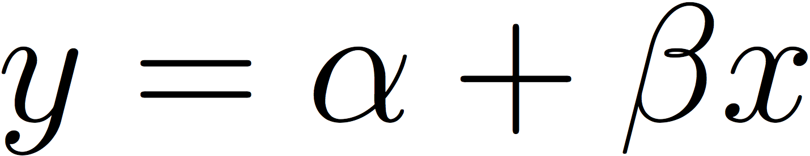

### CCJS 710 - Lesson 4 - Thursday 9/22/22

* We begin today's lesson by further considering the Minneapolis data set:

```R
df <- read.csv(file="minn.txt",sep=",",header=T)
head(df,n=10)
```

* Here is the output:

```Rout
> df <- read.csv(file="minn.txt",sep=",",header=T)
> head(df,n=10)
   id ta td aggcirc y
1   1  1  1       1 1
2   2  1  1       1 1
3   3  1  1       1 1
4   4  1  1       1 1
5   5  1  1       1 1
6   6  1  1       1 1
7   7  1  1       1 1
8   8  1  1       1 0
9   9  1  1       1 0
10 10  1  1       1 0
> 
```

* Next, let's create a contingency table -- showing the joint distribution of the randomized treatment and the failure outcome.
* In addition, we will create a binary arrest treatment variable and the original treatment-as-assigned variable.

```R
table(df$y,df$ta,exclude=NULL)

df$arr <- rep(NA,313)
df$arr[df$ta==1] <- 1
df$arr[df$ta==2 | df$ta==3] <- 0
table(df$arr,df$ta,exclude=NULL)
```

* Here is the output:

```Rout
> table(df$y,df$ta,exclude=NULL)
   
     1  2  3
  0 82 87 87
  1 10 21 26
> 
> df$arr <- rep(NA,313)
> df$arr[df$ta==1] <- 1
> df$arr[df$ta==2 | df$ta==3] <- 0
> table(df$arr,df$ta,exclude=NULL)
   
      1   2   3
  0   0 108 113
  1  92   0   0
> 
```

Now, we estimate the restricted and free logistic regression models using R's standard logistic
regression program:

```r
# use standard glm() program to estimate logistic 
# regression models (restricted and free)

restmodel <- glm(y~1,data=df,family=binomial(link="logit"))
freemodel <- glm(y~1+arr,data=df,family=binomial(link="logit"))

summary(restmodel)
pfailrest <- exp(-1.5021)/(1+exp(-1.5021))
pfailrest
logLik(restmodel)

summary(freemodel)
pfailarrest <- exp(-1.3089-0.7952)/(1+exp(-1.3089-0.7952))
pfailnoarrest <- exp(-1.3089)/(1+exp(-1.3089))
pfailarrest
pfailnoarrest
logLik(freemodel)

lrtest <- -2*(logLik(restmodel)-logLik(freemodel))
lrtest
attributes(lrtest) <- NULL
lrtest
```

and here are the results:

```rout
> # use standard glm() program to estimate logistic 
> # regression models (restricted and free)
> 
> restmodel <- glm(y~1,data=df,family=binomial(link="logit"))
> freemodel <- glm(y~1+arr,data=df,family=binomial(link="logit"))
> 
> summary(restmodel)

Call:
glm(formula = y ~ 1, family = binomial(link = "logit"), data = df)

Deviance Residuals: 
    Min       1Q   Median       3Q      Max  
-0.6341  -0.6341  -0.6341  -0.6341   1.8456  

Coefficients:
            Estimate Std. Error z value Pr(>|z|)    
(Intercept)  -1.5021     0.1465  -10.26   <2e-16 ***
---
Signif. codes:  0 ‘***’ 0.001 ‘**’ 0.01 ‘*’ 0.05 ‘.’ 0.1 ‘ ’ 1

(Dispersion parameter for binomial family taken to be 1)

    Null deviance: 297.08  on 312  degrees of freedom
Residual deviance: 297.08  on 312  degrees of freedom
AIC: 299.08

Number of Fisher Scoring iterations: 4

> pfailrest <- exp(-1.5021)/(1+exp(-1.5021))
> pfailrest
[1] 0.1821125
> logLik(restmodel)
'log Lik.' -148.5423 (df=1)
> 
> summary(freemodel)

Call:
glm(formula = y ~ 1 + arr, family = binomial(link = "logit"), 
    data = df)

Deviance Residuals: 
    Min       1Q   Median       3Q      Max  
-0.6915  -0.6915  -0.6915  -0.4797   2.1067  

Coefficients:
            Estimate Std. Error z value Pr(>|z|)    
(Intercept)  -1.3089     0.1644  -7.962 1.69e-15 ***
arr          -0.7952     0.3731  -2.131   0.0331 *  
---
Signif. codes:  0 ‘***’ 0.001 ‘**’ 0.01 ‘*’ 0.05 ‘.’ 0.1 ‘ ’ 1

(Dispersion parameter for binomial family taken to be 1)

    Null deviance: 297.08  on 312  degrees of freedom
Residual deviance: 291.98  on 311  degrees of freedom
AIC: 295.98

Number of Fisher Scoring iterations: 4

> pfailarrest <- exp(-1.3089-0.7952)/(1+exp(-1.3089-0.7952))
> pfailnoarrest <- exp(-1.3089)/(1+exp(-1.3089))
> pfailarrest
[1] 0.108699
> pfailnoarrest
[1] 0.212671
> logLik(freemodel)
'log Lik.' -145.9891 (df=2)
> 
> lrtest <- -2*(logLik(restmodel)-logLik(freemodel))
> lrtest
'log Lik.' 5.106266 (df=1)
> attributes(lrtest) <- NULL
> lrtest
[1] 5.106266
> 
```

Finally, we consider some R code to numerically maximize the likelihood
function for a logistic regression model. First, we show the
linear probability model which is:

<p align="center">

</p>

The problem with this model is that it can generate predicted
values of the outcome that are less than zero or greater than one. 
Most people prefer to use a logistic (or probit) regression
estimator instead. To estimate a logistic regression model,
we first define the logit as:

<p align="center">

</p>

This means that the probability of failure is:

<p align="center">

</p>

Then, the likelihood function is given by:

<p align="center">

</p>

where the first product is over the set of people who are observed 
to fail and the second product is over the set of people who are 
observed to succeed.  The natural log of the likelihood function is:

<p align="center">

</p>

Here is some R code we can use to numerically maximize this 
log-likelihood function:

```r
# verify data

table(df$y,df$arr,exclude=NULL)

# write the log-likelihood functions

library(maxLik)

llrest <- function(parms)
  {
    alpha <- parms[1]
    py1 <- exp(alpha)/(1+exp(alpha))
    pmf <- df$y*py1+(1-df$y)*(1-py1)
    lpmf <- log(pmf)
    return(lpmf)
  }

mrest <- maxLik(llrest,start=-0.5,method="BHHH",finalHessian="BHHH")
summary(mrest)


llfree <- function(parms)
  {
    alpha <- parms[1]
    beta <- parms[2]
    logit <- alpha+beta*df$arr
    py1 <- exp(logit)/(1+exp(logit))
    pmf <- df$y*py1+(1-df$y)*(1-py1)
    lpmf <- log(pmf)
    return(lpmf)
  }

mfree <- maxLik(llfree,start=c(-0.5,0),method="BHHH",finalHessian="BHHH")
summary(mfree)

# compare results to standard procedure

std_rest <- glm(y~1,data=df,family=binomial(link="logit"))
summary(std_rest)
logLik(std_rest)

std_free <- glm(y~1+arr,data=df,family=binomial(link="logit"))
summary(std_free)
logLik(std_free)
```

and here are the results:

```rout
> # verify data
> 
> table(df$y,df$arr,exclude=NULL)
   
      0   1
  0 174  82
  1  47  10
> 
> # write the log-likelihood functions
> 
> library(maxLik)
Loading required package: miscTools

Please cite the 'maxLik' package as:
Henningsen, Arne and Toomet, Ott (2011). maxLik: A package for maximum likelihood estimation in R. Computational Statistics 26(3), 443-458. DOI 10.1007/s00180-010-0217-1.

If you have questions, suggestions, or comments regarding the 'maxLik' package, please use a forum or 'tracker' at maxLik's R-Forge site:
https://r-forge.r-project.org/projects/maxlik/
> 
> llrest <- function(parms)
+   {
+     alpha <- parms[1]
+     py1 <- exp(alpha)/(1+exp(alpha))
+     pmf <- df$y*py1+(1-df$y)*(1-py1)
+     lpmf <- log(pmf)
+     return(lpmf)
+   }
> 
> mrest <- maxLik(llrest,start=-0.5,method="BHHH",finalHessian="BHHH")
> summary(mrest)
--------------------------------------------
Maximum Likelihood estimation
BHHH maximisation, 4 iterations
Return code 1: gradient close to zero
Log-Likelihood: -148.5423 
1  free parameters
Estimates:
     Estimate Std. error t value Pr(> t)    
[1,]  -1.5021     0.1465  -10.26  <2e-16 ***
---
Signif. codes:  0 ‘***’ 0.001 ‘**’ 0.01 ‘*’ 0.05 ‘.’ 0.1 ‘ ’ 1
--------------------------------------------
> 
> 
> llfree <- function(parms)
+   {
+     alpha <- parms[1]
+     beta <- parms[2]
+     logit <- alpha+beta*df$arr
+     py1 <- exp(logit)/(1+exp(logit))
+     pmf <- df$y*py1+(1-df$y)*(1-py1)
+     lpmf <- log(pmf)
+     return(lpmf)
+   }
> 
> mfree <- maxLik(llfree,start=c(-0.5,0),method="BHHH",finalHessian="BHHH")
> summary(mfree)
--------------------------------------------
Maximum Likelihood estimation
BHHH maximisation, 4 iterations
Return code 1: gradient close to zero
Log-Likelihood: -145.9891 
2  free parameters
Estimates:
     Estimate Std. error t value  Pr(> t)    
[1,]  -1.3089     0.1644  -7.962 1.69e-15 ***
[2,]  -0.7952     0.3731  -2.131   0.0331 *  
---
Signif. codes:  0 ‘***’ 0.001 ‘**’ 0.01 ‘*’ 0.05 ‘.’ 0.1 ‘ ’ 1
--------------------------------------------
> 
> # compare results to standard procedure
> 
> std_rest <- glm(y~1,data=df,family=binomial(link="logit"))
> summary(std_rest)

Call:
glm(formula = y ~ 1, family = binomial(link = "logit"), data = df)

Deviance Residuals: 
    Min       1Q   Median       3Q      Max  
-0.6341  -0.6341  -0.6341  -0.6341   1.8456  

Coefficients:
            Estimate Std. Error z value Pr(>|z|)    
(Intercept)  -1.5021     0.1465  -10.26   <2e-16 ***
---
Signif. codes:  0 ‘***’ 0.001 ‘**’ 0.01 ‘*’ 0.05 ‘.’ 0.1 ‘ ’ 1

(Dispersion parameter for binomial family taken to be 1)

    Null deviance: 297.08  on 312  degrees of freedom
Residual deviance: 297.08  on 312  degrees of freedom
AIC: 299.08

Number of Fisher Scoring iterations: 4

> logLik(std_rest)
'log Lik.' -148.5423 (df=1)
> 
> std_free <- glm(y~1+arr,data=df,family=binomial(link="logit"))
> summary(std_free)

Call:
glm(formula = y ~ 1 + arr, family = binomial(link = "logit"), 
    data = df)

Deviance Residuals: 
    Min       1Q   Median       3Q      Max  
-0.6915  -0.6915  -0.6915  -0.4797   2.1067  

Coefficients:
            Estimate Std. Error z value Pr(>|z|)    
(Intercept)  -1.3089     0.1644  -7.962 1.69e-15 ***
arr          -0.7952     0.3731  -2.131   0.0331 *  
---
Signif. codes:  0 ‘***’ 0.001 ‘**’ 0.01 ‘*’ 0.05 ‘.’ 0.1 ‘ ’ 1

(Dispersion parameter for binomial family taken to be 1)

    Null deviance: 297.08  on 312  degrees of freedom
Residual deviance: 291.98  on 311  degrees of freedom
AIC: 295.98

Number of Fisher Scoring iterations: 4

> logLik(std_free)
'log Lik.' -145.9891 (df=2)
> 
```

Now, let's examine our other model selection criteria including the 
Akaike Information Criterion (AIC) and the Bayesian Information Criterion (BIC).

```r
# calculates aic and bic using formulas outlined by
# Larry Wasserman (2000). Bayesian model selection and 
# model averaging. Journal of Mathematical Psychology, 
# 44:92-107

# parameters for the restricted model

loglike <- -148.5423
parms <- 1
ncases <- 313

# Akaike Information Criterion (AIC)
# choose model that maximizes AIC

aic <- loglike-parms
aic

# Bayesian Information Criterion (BIC)
# Schwarz Criterion (SC)
# BIC = SC
# choose model that maximizes BIC/SC

bic <- loglike-(parms/2)*log(ncases)
bic

# parameters for the unrestricted model

loglike <- -145.9891
parms <- 2
ncases <- 313

# Akaike Information Criterion (AIC)
# choose model that maximizes AIC

aic <- loglike-parms
aic

# Bayesian Information Criterion (BIC)
# Schwarz Criterion (SC)
# BIC = SC
# choose model that maximizes BIC/SC

bic <- loglike-(parms/2)*log(ncases)
bic
```

and here are the results:

```rout
> # calculates aic and bic using formulas outlined by
> # Larry Wasserman (2000). Bayesian model selection and 
> # model averaging. Journal of Mathematical Psychology, 
> # 44:92-107
> 
> # parameters for the restricted model
> 
> loglike <- -148.5423
> parms <- 1
> ncases <- 313
> 
> # Akaike Information Criterion (AIC)
> # choose model that maximizes AIC
> 
> aic <- loglike-parms
> aic
[1] -149.5423
> 
> # Bayesian Information Criterion (BIC)
> # Schwarz Criterion (SC)
> # BIC = SC
> # choose model that maximizes BIC/SC
> 
> bic <- loglike-(parms/2)*log(ncases)
> bic
[1] -151.4154
> 
> # parameters for the unrestricted model
> 
> loglike <- -145.9891
> parms <- 2
> ncases <- 313
> 
> # Akaike Information Criterion (AIC)
> # choose model that maximizes AIC
> 
> aic <- loglike-parms
> aic
[1] -147.9891
> 
> # Bayesian Information Criterion (BIC)
> # Schwarz Criterion (SC)
> # BIC = SC
> # choose model that maximizes BIC/SC
> 
> bic <- loglike-(parms/2)*log(ncases)
> bic
[1] -151.7353
> 
```

Note that this example is a case where the model selection criteria are not in agreement
with each other. The likelihood-ratio test and AIC would lead us to select the two-parameter
model while the BIC would lead us to select the one-parameter model. Because circumstances
like these can arise in practical situations, it is important to specify in advance what
the criteria will be prior to analyzing the data.
