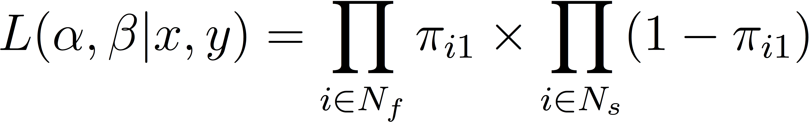

### CCJS 710 - Lesson 4 - Thursday 9/22/22

#### Part 1: Elaboration of Last Week's Example

* Here is the experimental data:

```Rout
> table(df$y,df$ta,exclude=NULL)
   ta
y    1  2  3
  0 82 87 87
  1 10 21 26
> 
```

These results tell us that: (1) there were 92 people assigned to the
arrest condition and 10 of those people were observed to fail; (2) 
there were 108 people assigned to the mediation condition and 21 of them 
failed; and (3) there were 113 people assigned to the advise treatment 
and 26 of them failed. In this analysis, we will compare the failure 
rate of the people assigned to the arrest condition to the rate for 
the two no-arrest conditions, combined. First, we estimate the 
overall failure rate which is given by:

<p align="center">

</p>

Based on last week's lesson, we know this estimate also maximizes the binomial likelihood 
function. The likelihood is:

<p align="center">

</p>

We can think of this as the probability of the data looking the 
way they do conditioning on the binomial probability mass function 
with the constraint that &#960; is bounded by 0 and 1. To 
visualize the likelihood function, we calculate it while
&#960; varies across its range from 0 to 1; then we plot 
the function.  Here is the R code:

```R
n <- 313
r <- 57
r/n
pi <- seq(from=0,to=1,by=0.001)
ncr <- choose(n,r)
likelihood <- ncr*(pi^r)*((1-pi)^(n-r))

# concatenate pi and likelihood into the
# same data frame, then select the pair
# that maximizes the likelihood function

like <- data.frame(pi,likelihood)

neighborhood <- subset(like,
  abs(likelihood-max(like$likelihood))<0.01)
neighborhood

# Likelihood plot for entire sample 
# of 313 cases

plot(x=pi,y=likelihood,
     type="l",lty=1,lwd=3,col="darkred",
  main="Likelihood Function for Failure Prevalence",
  xlab=expression(pi),ylab="Likelihood Function",ylim=c(0,0.07))
```

Here is the output:

```rout
> n <- 313
> r <- 57
> r/n
[1] 0.1821086
> pi <- seq(from=0,to=1,by=0.001)
> ncr <- choose(n,r)
> likelihood <- ncr*(pi^r)*((1-pi)^(n-r))
> 
> # concatenate pi and likelihood into the
> # same data frame, then select the pair
> # that maximizes the likelihood function
> 
> like <- data.frame(pi,likelihood)
> 
> neighborhood <- subset(like,
+   abs(likelihood-max(like$likelihood))<0.01)
> neighborhood
       pi likelihood
170 0.169 0.04835575
171 0.170 0.04973064
172 0.171 0.05102488
173 0.172 0.05223139
174 0.173 0.05334359
175 0.174 0.05435546
176 0.175 0.05526161
177 0.176 0.05605730
178 0.177 0.05673851
179 0.178 0.05730194
180 0.179 0.05774507
181 0.180 0.05806613
182 0.181 0.05826417
183 0.182 0.05833897
184 0.183 0.05829113
185 0.184 0.05812199
186 0.185 0.05783361
187 0.186 0.05742875
188 0.187 0.05691086
189 0.188 0.05628398
190 0.189 0.05555273
191 0.190 0.05472226
192 0.191 0.05379815
193 0.192 0.05278643
194 0.193 0.05169344
195 0.194 0.05052580
196 0.195 0.04929038
> 
> # Likelihood plot for entire sample 
> # of 313 cases
> 
> plot(x=pi,y=likelihood,
+      type="l",lty=1,lwd=3,col="darkred",
+   main="Likelihood Function for Failure Prevalence",
+   xlab=expression(pi),ylab="Likelihood Function",ylim=c(0,0.07))
> 
```

Here is the visual summary of the likelihood function:

<p align="center">
 
</p>

The graph of the likelihood function reveals that it is 
maximized when &#960; is close to 0.20 and the table in 
the output above shows that setting &#960; equal to 0.182 
does maximize the function (the R output reveals that the 
peak of the likelihood function is 0.0583).

## Using Maximum Likelihood Methods to Test a Hypothesis ##

Now, let's use the idea of likelihood to estimate a treatment
effect. First, we estimate the proportion of people who fail in the
arrest group:

<p align="center">

</p>

Then, we estimate the proportion of people observed to fail in the 
no-arrest (control) group:

<p align="center">

</p>

The hypothesis to be tested is whether these two proportions are equal.
Here is some R code to solve this problem using the method of maximum
likelihood:

```R
# enter the data

na <- 92
ra <- 10
nc <- 108+113
rc <- 21+26

# check the results

na
ra
nc
rc

# failure rates conditioned on treatment

ra/na
rc/nc

# now let's maximize the likelihood function separately
# for each of our two groups:

# first, generate a stream of pi's

pi <- seq(from=0,to=1,by=0.001)

# next, calculate likelihood function for the arrest group

na_c_ra <- choose(na,ra)
likelihood_arrest <- na_c_ra*(pi^ra)*((1-pi)^(na-ra))

# now let's identify the value of pi that maximizes the
# likelihood function for the arrest group 

arrest_cases <- data.frame(pi,likelihood_arrest)
arrest_neighborhood <- subset(arrest_cases,
  abs(likelihood_arrest-max(arrest_cases$likelihood_arrest))<0.01)
arrest_neighborhood

# for the no-arrest (control) group, the likelihood is:

nc_c_rc <- choose(nc,rc)
likelihood_control <- nc_c_rc*(pi^rc)*((1-pi)^(nc-rc))

# identify value of pi that maximizes likelihood function
# for the control group

control_cases <- data.frame(pi,likelihood_control)
control_neighborhood <- subset(control_cases,
  abs(likelihood_control-max(control_cases$likelihood_control))<0.01)
control_neighborhood

# Likelihood plot for entire sample and the two groups

plot(x=pi,y=likelihood,
     type="l",lty=1,lwd=3,col="darkred",
  main="Likelihood Functions for Failure Prevalence",
  xlab=expression(pi),ylab="Likelihood Function",ylim=c(0,0.15))
lines(x=pi,y=likelihood_arrest,lty=1,lwd=3,col="darkgreen")
lines(x=pi,y=likelihood_control,lty=1,lwd=3,col="darkorange")
text(x=0.02,y=0.14,adj=c(0,0.5),"Arrest Group (N = 92)")
text(x=0.182,y=0.063,"All Cases Combined (N = 313)",adj=c(0,0.5),srt=90)
text(x=0.23,y=0.068,"Control Group (N = 221)",adj=c(0,0.5))
```

and here are the results:

```
> # enter the data
> 
> na <- 92
> ra <- 10
> nc <- 108+113
> rc <- 21+26
> 
> # check the results
> 
> na
[1] 92
> ra
[1] 10
> nc
[1] 221
> rc
[1] 47
> 
> # failure rates conditioned on treatment
> 
> ra/na
[1] 0.1086957
> rc/nc
[1] 0.2126697
> 
> # now let's maximize the likelihood function separately
> # for each of our two groups:
> 
> # first, generate a stream of pi's
> 
> pi <- seq(from=0,to=1,by=0.001)
> 
> # next, calculate likelihood function for the arrest group
> 
> na_c_ra <- choose(na,ra)
> likelihood_arrest <- na_c_ra*(pi^ra)*((1-pi)^(na-ra))
> 
> # now let's identify the value of pi that maximizes the
> # likelihood function for the arrest group
> 
> arrest_cases <- data.frame(pi,likelihood_arrest)
> arrest_neighborhood <- subset(arrest_cases,
+   abs(likelihood_arrest-max(arrest_cases$likelihood_arrest))<0.01)
> arrest_neighborhood
       pi likelihood_arrest
98  0.097         0.1236199
99  0.098         0.1250755
100 0.099         0.1264038
101 0.100         0.1276031
102 0.101         0.1286719
103 0.102         0.1296095
104 0.103         0.1304151
105 0.104         0.1310888
106 0.105         0.1316307
107 0.106         0.1320415
108 0.107         0.1323222
109 0.108         0.1324741
110 0.109         0.1324988
111 0.110         0.1323984
112 0.111         0.1321751
113 0.112         0.1318314
114 0.113         0.1313701
115 0.114         0.1307944
116 0.115         0.1301074
117 0.116         0.1293126
118 0.117         0.1284138
119 0.118         0.1274147
120 0.119         0.1263192
121 0.120         0.1251316
122 0.121         0.1238559
> 
> # for the no-arrest (control) group, the likelihood is:
> 
> nc_c_rc <- choose(nc,rc)
> likelihood_control <- nc_c_rc*(pi^rc)*((1-pi)^(nc-rc))
> 
> # identify value of pi that maximizes likelihood function
> # for the control group
> 
> control_cases <- data.frame(pi,likelihood_control)
> control_neighborhood <- subset(control_cases,
+   abs(likelihood_control-max(control_cases$likelihood_control))<0.01)
> control_neighborhood
       pi likelihood_control
199 0.198         0.05650624
200 0.199         0.05762949
201 0.200         0.05868943
202 0.201         0.05968245
203 0.202         0.06060519
204 0.203         0.06145455
205 0.204         0.06222774
206 0.205         0.06292225
207 0.206         0.06353589
208 0.207         0.06406682
209 0.208         0.06451351
210 0.209         0.06487479
211 0.210         0.06514980
212 0.211         0.06533807
213 0.212         0.06543945
214 0.213         0.06545414
215 0.214         0.06538268
216 0.215         0.06522593
217 0.216         0.06498507
218 0.217         0.06466160
219 0.218         0.06425732
220 0.219         0.06377429
221 0.220         0.06321487
222 0.221         0.06258163
223 0.222         0.06187740
224 0.223         0.06110520
225 0.224         0.06026827
226 0.225         0.05936999
227 0.226         0.05841389
228 0.227         0.05740366
229 0.228         0.05634306
> 
> # Likelihood plot for entire sample and the two groups
> plot(x=pi,y=likelihood,
+      type="l",lty=1,lwd=3,col="darkred",
+   main="Likelihood Functions for Failure Prevalence",
+   xlab=expression(pi),ylab="Likelihood Function",ylim=c(0,0.15))
> lines(x=pi,y=likelihood_arrest,lty=1,lwd=3,col="darkgreen")
> lines(x=pi,y=likelihood_control,lty=1,lwd=3,col="darkorange")
> text(x=0.02,y=0.14,adj=c(0,0.5),"Arrest Group (N = 92)")
> text(x=0.182,y=0.063,"All Cases Combined (N = 313)",adj=c(0,0.5),srt=90)
> text(x=0.23,y=0.068,"Control Group (N = 221)",adj=c(0,0.5))
> 
```

and a graphical summary of the likelihood functions looks like this:

<p align="center">

</p>

Now, we are ready to work on the hypothesis tests. Here is the R code
to do this work:

```R
# free likelihoods from grid search

arrest_likelihood_free <- 0.1324988
noarrest_likelihood_free <- 0.06545414

# mle of pi for everyone combined used to impose 
# restriction that pi for whole sample is a good summary

all_pi_mle <- 0.182

# calculate L(pi|arrest,pi=0.1821086)

n <- 92
r <- 10
r/n
pi <- all_pi_mle
ncr <- choose(n,r)
arrest_likelihood_rest <- ncr*(pi^r)*((1-pi)^(n-r))
arrest_likelihood_rest

# calculate L(pi|no arrest,pi=0.1821086)

n <- 108+113
r <- 21+26
r/n
pi <- all_pi_mle
ncr <- choose(n,r)
noarrest_likelihood_rest <- ncr*(pi^r)*((1-pi)^(n-r))
noarrest_likelihood_rest

# calculate restricted likelihood

restricted <- arrest_likelihood_rest*noarrest_likelihood_rest
restricted

# calculate unrestricted (free) likelihood

unrestricted <- arrest_likelihood_free*noarrest_likelihood_free
unrestricted

# likelihood ratio

lr <- restricted/unrestricted

# log-likelihood ratio

llr <- log(restricted)-log(unrestricted)

# chi-square statistic

llr2 <- -2*llr
llr2

# there is a difference of one parameter between the
# restricted and unrestricted models; so the test
# has one degree of freedom. The critical value of
# the chi-square statistic with one degree of freedom is:

qchisq(p=0.95,df=1)
```

and here are the results of these calculations:

```
> # free likelihoods from grid search
> 
> arrest_likelihood_free <- 0.1324988
> noarrest_likelihood_free <- 0.06545414
> 
> # mle of pi for everyone combined used to impose
> # restriction that pi for whole sample is a good summary
> 
> all_pi_mle <- 0.182
> 
> # calculate L(pi|arrest,pi=0.1821086)
> 
> n <- 92
> r <- 10
> r/n
[1] 0.1086957
> pi <- all_pi_mle
> ncr <- choose(n,r)
> arrest_likelihood_rest <- ncr*(pi^r)*((1-pi)^(n-r))
> arrest_likelihood_rest
[1] 0.02015859
> 
> # calculate L(pi|no arrest,pi=0.1821086)
> 
> n <- 108+113
> r <- 21+26
> r/n
[1] 0.2126697
> pi <- all_pi_mle
> ncr <- choose(n,r)
> noarrest_likelihood_rest <- ncr*(pi^r)*((1-pi)^(n-r))
> noarrest_likelihood_rest
[1] 0.03349056
> 
> # calculate restricted likelihood
> 
> restricted <- arrest_likelihood_rest*noarrest_likelihood_rest
> restricted
[1] 0.0006751225
> 
> # calculate unrestricted (free) likelihood
> 
> unrestricted <- arrest_likelihood_free*noarrest_likelihood_free
> unrestricted
[1] 0.008672595
> 
> # likelihood ratio
> 
> lr <- restricted/unrestricted
> 
> # log-likelihood ratio
> 
> llr <- log(restricted)-log(unrestricted)
> 
> # chi-square statistic
> 
> llr2 <- -2*llr
> llr2
[1] 5.106058
> # square root of -2llr
>
># there is a difference of one parameter between the
># restricted and unrestricted models; so the test
># has one degree of freedom. The critical value of
># the chi-square statistic with one degree of freedom is:
> 
> qchisq(p=0.95,df=1)
[1] 3.841459
> 
```

Since 5.106 exceeds the critical value of 3.841, we reject the 
hypothesis of equal failure rates and conclude that an unrestricted 
model allowing for different failure rates between the arrest and 
control groups is more consistent with the Minneapolis data set. 

#### Part 2: Using the GLM function to estimate the parameters of a logistic regression equation

* We begin today's lesson by further considering the Minneapolis data set:

```R
df <- read.csv(file="minn.txt",sep=",",header=T)
head(df,n=10)
```

* Here is the output:

```Rout
> df <- read.csv(file="minn.txt",sep=",",header=T)
> head(df,n=10)
   id ta td aggcirc y
1   1  1  1       1 1
2   2  1  1       1 1
3   3  1  1       1 1
4   4  1  1       1 1
5   5  1  1       1 1
6   6  1  1       1 1
7   7  1  1       1 1
8   8  1  1       1 0
9   9  1  1       1 0
10 10  1  1       1 0
> 
```

* Next, let's create a contingency table -- showing the joint distribution of the randomized treatment and the failure outcome.
* In addition, we will create a binary arrest treatment variable and the original treatment-as-assigned variable.

```R
table(df$y,df$ta,exclude=NULL)

df$arr <- rep(NA,313)
df$arr[df$ta==1] <- 1
df$arr[df$ta==2 | df$ta==3] <- 0
table(df$arr,df$ta,exclude=NULL)
```

* Here is the output:

```Rout
> table(df$y,df$ta,exclude=NULL)
   
     1  2  3
  0 82 87 87
  1 10 21 26
> 
> df$arr <- rep(NA,313)
> df$arr[df$ta==1] <- 1
> df$arr[df$ta==2 | df$ta==3] <- 0
> table(df$arr,df$ta,exclude=NULL)
   
      1   2   3
  0   0 108 113
  1  92   0   0
> 
```

Now, we estimate the restricted and free logistic regression models using R's standard logistic
regression program:

```r
# use standard glm() program to estimate logistic 
# regression models (restricted and free)

restmodel <- glm(y~1,data=df,family=binomial(link="logit"))
freemodel <- glm(y~1+arr,data=df,family=binomial(link="logit"))

summary(restmodel)
pfailrest <- exp(-1.5021)/(1+exp(-1.5021))
pfailrest
logLik(restmodel)

summary(freemodel)
pfailarrest <- exp(-1.3089-0.7952)/(1+exp(-1.3089-0.7952))
pfailnoarrest <- exp(-1.3089)/(1+exp(-1.3089))
pfailarrest
pfailnoarrest
logLik(freemodel)

lrtest <- -2*(logLik(restmodel)-logLik(freemodel))
lrtest
attributes(lrtest) <- NULL
lrtest
```

and here are the results:

```rout
> # use standard glm() program to estimate logistic 
> # regression models (restricted and free)
> 
> restmodel <- glm(y~1,data=df,family=binomial(link="logit"))
> freemodel <- glm(y~1+arr,data=df,family=binomial(link="logit"))
> 
> summary(restmodel)

Call:
glm(formula = y ~ 1, family = binomial(link = "logit"), data = df)

Deviance Residuals: 
    Min       1Q   Median       3Q      Max  
-0.6341  -0.6341  -0.6341  -0.6341   1.8456  

Coefficients:
            Estimate Std. Error z value Pr(>|z|)    
(Intercept)  -1.5021     0.1465  -10.26   <2e-16 ***
---
Signif. codes:  0 ‘***’ 0.001 ‘**’ 0.01 ‘*’ 0.05 ‘.’ 0.1 ‘ ’ 1

(Dispersion parameter for binomial family taken to be 1)

    Null deviance: 297.08  on 312  degrees of freedom
Residual deviance: 297.08  on 312  degrees of freedom
AIC: 299.08

Number of Fisher Scoring iterations: 4

> pfailrest <- exp(-1.5021)/(1+exp(-1.5021))
> pfailrest
[1] 0.1821125
> logLik(restmodel)
'log Lik.' -148.5423 (df=1)
> 
> summary(freemodel)

Call:
glm(formula = y ~ 1 + arr, family = binomial(link = "logit"), 
    data = df)

Deviance Residuals: 
    Min       1Q   Median       3Q      Max  
-0.6915  -0.6915  -0.6915  -0.4797   2.1067  

Coefficients:
            Estimate Std. Error z value Pr(>|z|)    
(Intercept)  -1.3089     0.1644  -7.962 1.69e-15 ***
arr          -0.7952     0.3731  -2.131   0.0331 *  
---
Signif. codes:  0 ‘***’ 0.001 ‘**’ 0.01 ‘*’ 0.05 ‘.’ 0.1 ‘ ’ 1

(Dispersion parameter for binomial family taken to be 1)

    Null deviance: 297.08  on 312  degrees of freedom
Residual deviance: 291.98  on 311  degrees of freedom
AIC: 295.98

Number of Fisher Scoring iterations: 4

> pfailarrest <- exp(-1.3089-0.7952)/(1+exp(-1.3089-0.7952))
> pfailnoarrest <- exp(-1.3089)/(1+exp(-1.3089))
> pfailarrest
[1] 0.108699
> pfailnoarrest
[1] 0.212671
> logLik(freemodel)
'log Lik.' -145.9891 (df=2)
> 
> lrtest <- -2*(logLik(restmodel)-logLik(freemodel))
> lrtest
'log Lik.' 5.106266 (df=1)
> attributes(lrtest) <- NULL
> lrtest
[1] 5.106266
> 
```

Finally, we consider some R code to numerically maximize the likelihood
function for a logistic regression model. First, we show the
linear probability model which is:

<p align="center">

</p>

The problem with this model is that it can generate predicted
values of the outcome (see below) that are less than zero or greater than one.

<p align="center">

</p>

Most people prefer to use a logistic (or probit) regression
estimator instead. To estimate a logistic regression model,
we first define the logit as:

<p align="center">

</p>

This means that the probability of failure is:

<p align="center">

</p>

Then, the likelihood function is given by:

<p align="center">

</p>

where the first product is over the set of people who are observed 
to fail and the second product is over the set of people who are 
observed to succeed.  The natural log of the likelihood function is:

<p align="center">

</p>

Here is some R code we can use to numerically maximize this 
log-likelihood function:

```r
# verify data

table(df$y,df$arr,exclude=NULL)

# write the log-likelihood functions

library(maxLik)

llrest <- function(parms)
  {
    alpha <- parms[1]
    py1 <- exp(alpha)/(1+exp(alpha))
    pmf <- df$y*py1+(1-df$y)*(1-py1)
    lpmf <- log(pmf)
    return(lpmf)
  }

mrest <- maxLik(llrest,start=-0.5,method="BHHH",finalHessian="BHHH")
summary(mrest)


llfree <- function(parms)
  {
    alpha <- parms[1]
    beta <- parms[2]
    logit <- alpha+beta*df$arr
    py1 <- exp(logit)/(1+exp(logit))
    pmf <- df$y*py1+(1-df$y)*(1-py1)
    lpmf <- log(pmf)
    return(lpmf)
  }

mfree <- maxLik(llfree,start=c(-0.5,0),method="BHHH",finalHessian="BHHH")
summary(mfree)

# compare results to standard procedure

std_rest <- glm(y~1,data=df,family=binomial(link="logit"))
summary(std_rest)
logLik(std_rest)

std_free <- glm(y~1+arr,data=df,family=binomial(link="logit"))
summary(std_free)
logLik(std_free)
```

and here are the results:

```rout
> # verify data
> 
> table(df$y,df$arr,exclude=NULL)
   
      0   1
  0 174  82
  1  47  10
> 
> # write the log-likelihood functions
> 
> library(maxLik)
Loading required package: miscTools

Please cite the 'maxLik' package as:
Henningsen, Arne and Toomet, Ott (2011). maxLik: A package for maximum likelihood estimation in R. Computational Statistics 26(3), 443-458. DOI 10.1007/s00180-010-0217-1.

If you have questions, suggestions, or comments regarding the 'maxLik' package, please use a forum or 'tracker' at maxLik's R-Forge site:
https://r-forge.r-project.org/projects/maxlik/
> 
> llrest <- function(parms)
+   {
+     alpha <- parms[1]
+     py1 <- exp(alpha)/(1+exp(alpha))
+     pmf <- df$y*py1+(1-df$y)*(1-py1)
+     lpmf <- log(pmf)
+     return(lpmf)
+   }
> 
> mrest <- maxLik(llrest,start=-0.5,method="BHHH",finalHessian="BHHH")
> summary(mrest)
--------------------------------------------
Maximum Likelihood estimation
BHHH maximisation, 4 iterations
Return code 1: gradient close to zero
Log-Likelihood: -148.5423 
1  free parameters
Estimates:
     Estimate Std. error t value Pr(> t)    
[1,]  -1.5021     0.1465  -10.26  <2e-16 ***
---
Signif. codes:  0 ‘***’ 0.001 ‘**’ 0.01 ‘*’ 0.05 ‘.’ 0.1 ‘ ’ 1
--------------------------------------------
> 
> 
> llfree <- function(parms)
+   {
+     alpha <- parms[1]
+     beta <- parms[2]
+     logit <- alpha+beta*df$arr
+     py1 <- exp(logit)/(1+exp(logit))
+     pmf <- df$y*py1+(1-df$y)*(1-py1)
+     lpmf <- log(pmf)
+     return(lpmf)
+   }
> 
> mfree <- maxLik(llfree,start=c(-0.5,0),method="BHHH",finalHessian="BHHH")
> summary(mfree)
--------------------------------------------
Maximum Likelihood estimation
BHHH maximisation, 4 iterations
Return code 1: gradient close to zero
Log-Likelihood: -145.9891 
2  free parameters
Estimates:
     Estimate Std. error t value  Pr(> t)    
[1,]  -1.3089     0.1644  -7.962 1.69e-15 ***
[2,]  -0.7952     0.3731  -2.131   0.0331 *  
---
Signif. codes:  0 ‘***’ 0.001 ‘**’ 0.01 ‘*’ 0.05 ‘.’ 0.1 ‘ ’ 1
--------------------------------------------
> 
> # compare results to standard procedure
> 
> std_rest <- glm(y~1,data=df,family=binomial(link="logit"))
> summary(std_rest)

Call:
glm(formula = y ~ 1, family = binomial(link = "logit"), data = df)

Deviance Residuals: 
    Min       1Q   Median       3Q      Max  
-0.6341  -0.6341  -0.6341  -0.6341   1.8456  

Coefficients:
            Estimate Std. Error z value Pr(>|z|)    
(Intercept)  -1.5021     0.1465  -10.26   <2e-16 ***
---
Signif. codes:  0 ‘***’ 0.001 ‘**’ 0.01 ‘*’ 0.05 ‘.’ 0.1 ‘ ’ 1

(Dispersion parameter for binomial family taken to be 1)

    Null deviance: 297.08  on 312  degrees of freedom
Residual deviance: 297.08  on 312  degrees of freedom
AIC: 299.08

Number of Fisher Scoring iterations: 4

> logLik(std_rest)
'log Lik.' -148.5423 (df=1)
> 
> std_free <- glm(y~1+arr,data=df,family=binomial(link="logit"))
> summary(std_free)

Call:
glm(formula = y ~ 1 + arr, family = binomial(link = "logit"), 
    data = df)

Deviance Residuals: 
    Min       1Q   Median       3Q      Max  
-0.6915  -0.6915  -0.6915  -0.4797   2.1067  

Coefficients:
            Estimate Std. Error z value Pr(>|z|)    
(Intercept)  -1.3089     0.1644  -7.962 1.69e-15 ***
arr          -0.7952     0.3731  -2.131   0.0331 *  
---
Signif. codes:  0 ‘***’ 0.001 ‘**’ 0.01 ‘*’ 0.05 ‘.’ 0.1 ‘ ’ 1

(Dispersion parameter for binomial family taken to be 1)

    Null deviance: 297.08  on 312  degrees of freedom
Residual deviance: 291.98  on 311  degrees of freedom
AIC: 295.98

Number of Fisher Scoring iterations: 4

> logLik(std_free)
'log Lik.' -145.9891 (df=2)
> 
```

Now, let's examine our other model selection criteria including the 
Akaike Information Criterion (AIC) and the Bayesian Information Criterion (BIC).

```r
# calculates aic and bic using formulas outlined by
# Larry Wasserman (2000). Bayesian model selection and 
# model averaging. Journal of Mathematical Psychology, 
# 44:92-107

# parameters for the restricted model

loglike <- -148.5423
parms <- 1
ncases <- 313

# Akaike Information Criterion (AIC)
# choose model that maximizes AIC

aic <- loglike-parms
aic

# Bayesian Information Criterion (BIC)
# Schwarz Criterion (SC)
# BIC = SC
# choose model that maximizes BIC/SC

bic <- loglike-(parms/2)*log(ncases)
bic

# parameters for the unrestricted model

loglike <- -145.9891
parms <- 2
ncases <- 313

# Akaike Information Criterion (AIC)
# choose model that maximizes AIC

aic <- loglike-parms
aic

# Bayesian Information Criterion (BIC)
# Schwarz Criterion (SC)
# BIC = SC
# choose model that maximizes BIC/SC

bic <- loglike-(parms/2)*log(ncases)
bic
```

and here are the results:

```rout
> # calculates aic and bic using formulas outlined by
> # Larry Wasserman (2000). Bayesian model selection and 
> # model averaging. Journal of Mathematical Psychology, 
> # 44:92-107
> 
> # parameters for the restricted model
> 
> loglike <- -148.5423
> parms <- 1
> ncases <- 313
> 
> # Akaike Information Criterion (AIC)
> # choose model that maximizes AIC
> 
> aic <- loglike-parms
> aic
[1] -149.5423
> 
> # Bayesian Information Criterion (BIC)
> # Schwarz Criterion (SC)
> # BIC = SC
> # choose model that maximizes BIC/SC
> 
> bic <- loglike-(parms/2)*log(ncases)
> bic
[1] -151.4154
> 
> # parameters for the unrestricted model
> 
> loglike <- -145.9891
> parms <- 2
> ncases <- 313
> 
> # Akaike Information Criterion (AIC)
> # choose model that maximizes AIC
> 
> aic <- loglike-parms
> aic
[1] -147.9891
> 
> # Bayesian Information Criterion (BIC)
> # Schwarz Criterion (SC)
> # BIC = SC
> # choose model that maximizes BIC/SC
> 
> bic <- loglike-(parms/2)*log(ncases)
> bic
[1] -151.7353
> 
```

Note that this example is a case where the model selection criteria are not in agreement
with each other. The likelihood-ratio test and AIC would lead us to select the two-parameter
model while the BIC would lead us to select the one-parameter model. Because circumstances
like these can arise in practical situations, it is important to specify in advance what
the criteria will be prior to analyzing the data.
